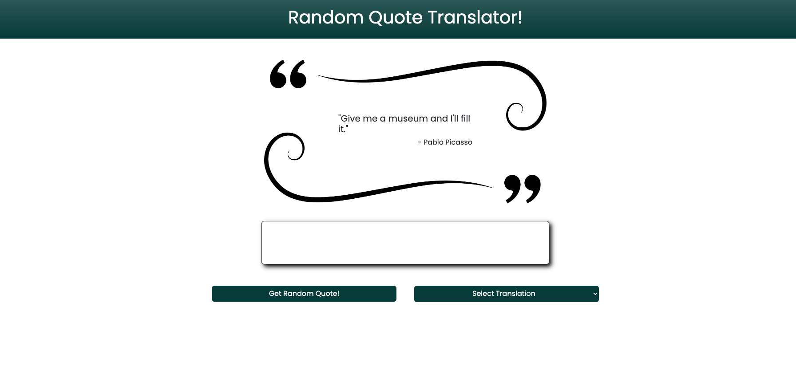

# Random Quote Translator

## Table of Contents

- [Introduction](#introduction)
- [Features](#features)
- [Usage](#usage)
- [Installation](#installation)
- [Technologies Used](#technologies-used)
- [Contributing](#contributing)
- [Creators](#creators)

## Introduction

Random Quote Translator is a web application that generates random famous quotes and allows users to translate them into various fun and fictional languages. Whether you want to hear a quote in Yoda's speech, Leet Speak, Groot's language, Pirate Speak, Pig-Latin, or Klingon, this application has got you covered.

## Features

- Get random famous quotes with the click of a button.
- Choose from various translation options such as Yoda Speak, Leet Speak, Groot, Pirate Speak, Pig-Latin, and Klingon.
- Visual enhancements for certain translations, like background images or sounds.

## Usage

1. Visit the [live demo](#) or clone the repository.
2. Open the `index.html` file in your preferred web browser.
3. Click the "Get Random Quote!" button to fetch a random famous quote.
4. Select a translation from the dropdown menu and see the quote transformed into the chosen language.
5. Enjoy the visual enhancements for specific translations, such as background images or sounds.

## Technologies Used

- HTML
- CSS (Bootstrap 5)
- JavaScript
- jQuery
- Random Famous Quotes API
- Fun Translations API

## Contributing

If you'd like to contribute to this project, please follow these guidelines:

1. Fork the repository.
2. Create a new branch for your feature: `git checkout -b feature-name`.
3. Make your changes and commit them: `git commit -m 'Add new feature'`.
4. Push to the branch: `git push origin feature-name`.
5. Submit a pull request.

## Creators

- [Phil](https://github.com/plucafo)

- [Marty](https://github.com/mlofaso)

- [Rishi](https://github.com/zafeera1)

 

[Back to top](#)
